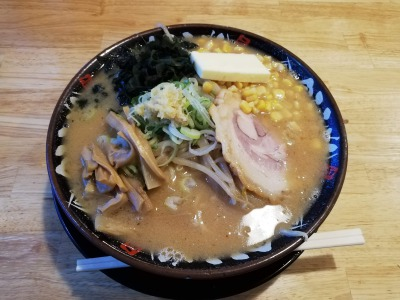

# ramen


A toy OS

## Requirements
- A computer supporting UEFI or QEMU
- mtools (if you want to run on QEMU)
- OVMF_VARS.fd and OVMF_CODE.fd (if you want to run on QEMU)
- Rustup nightly version

## Run on QEMU

### How to get `OVMF_VARS.fd` and `OVMF_CODE.fd`

For Gentoo users:

```sh
sudo USE="binary" emerge sys-firmware/edk2-ovmf
cp /usr/share/edk2-ovmf/{OVMF_VARS.fd,OVMF_CODE.fd} /path/to/ramen
```

### Execution

```sh
git clone https://github.com/toku-sa-n/ramen
cd ramen
rustup override set nightly
make run
```

## Run on your computer

You have to create an EFI partition.

Then run the following command:
```sh
git clone https://github.com/toku-sa-n/ramen.git
cd ramen
rustup override set nightly
make
USB_DEVICE_PATH="/dev/sdx1" make copy_to_usb
```
(/dev/sdx1 is the EFI partition you created.)

### Execution
Reboot your machine and run Ramen OS.

## License

GPL-3.0 or later. See [LICENSE](https://github.com/toku-sa-n/ramen/blob/master/LICENSE).

---
<div style="text-align:center;"></div>

(This image is not related to the project.)
